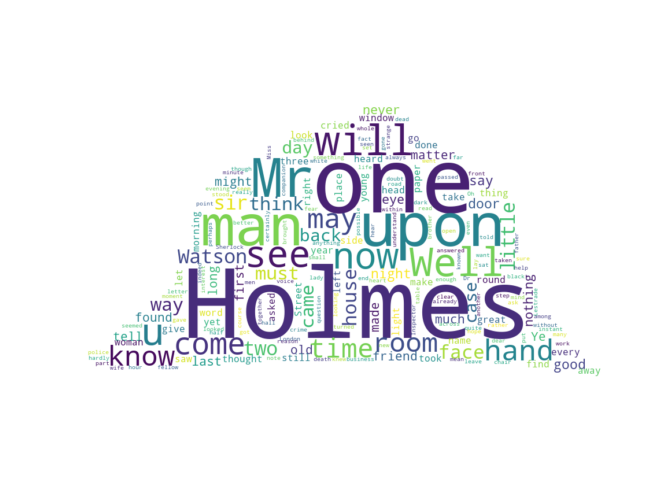

R Markdown Homework Assignment
================
Gyüre Szabolcs (EVBLZ8)

First, let’s display some system information:

    ## "Machine type: AMD64

    ## Node name: DESKTOP-6TUL6C6

    ## OS name: Windows

    ## OS release: 10

    ## OS version: 10.0.19044

    ## User name: Szabi

    ## Home directory: C:\Users\Szabi

    ## Current directory: C:\Users\Szabi\Downloads\Egyetem\webtech\rmarkdown-assignment-infiteder-master

    ## PATH: C:\Users\Szabi\miniconda3\envs\rmarkdown;C:\Users\Szabi\miniconda3\envs\rmarkdown\Library\mingw-w64\bin;C:\Users\Szabi\miniconda3\envs\rmarkdown\Library\usr\bin;C:\Users\Szabi\miniconda3\envs\rmarkdown\Library\bin;C:\Users\Szabi\miniconda3\envs\rmarkdown\Scripts;C:\Users\Szabi\miniconda3\envs\rmarkdown\bin;C:\WINDOWS\system32;C:\WINDOWS;C:\WINDOWS\System32\Wbem;C:\WINDOWS\System32\WindowsPowerShell\v1.0;C:\WINDOWS\System32\OpenSSH;C:\Users\Szabi\AppData\Local\Microsoft\WindowsApps;C:\Users\Szabi\miniconda3;C:\Users\Szabi\miniconda3\Library;C:\Users\Szabi\miniconda3\Scripts;C:\Users\Szabi\miniconda3\condabin;C:\Users\Szabi\miniconda3\Library\bin;C:\Users\Szabi\miniconda3\envs

Let’s create a word cloud of the complete Sherlock Holmes Canon that is
available in plain text from
[here](https://sherlock-holm.es/stories/plain-text/cano.txt).

The word cloud can be generated with the
[word_cloud](https://github.com/amueller/word_cloud) package as follows:

``` python
from wordcloud import WordCloud, STOPWORDS
import urllib.request
from PIL import Image
import numpy as np

text = urllib.request.urlopen('https://sherlock-holm.es/stories/plain-text/cano.txt').read().decode('utf-8')

stopwords = set(STOPWORDS)
stopwords.add("said")

mask = np.array(Image.open('detectiveHat.png'))

wordcloud = WordCloud(stopwords=stopwords, collocations=False, mask=mask, margin=0, background_color='white').generate(text)

import matplotlib.pyplot as plt
plt.imshow(wordcloud, interpolation='bilinear')
plt.axis("off")
```

    ## (-0.5, 900.5, 485.5, -0.5)

``` python
plt.show()
```

<!-- -->

This document was generated on October 04, 2022 at 10:01:05.
